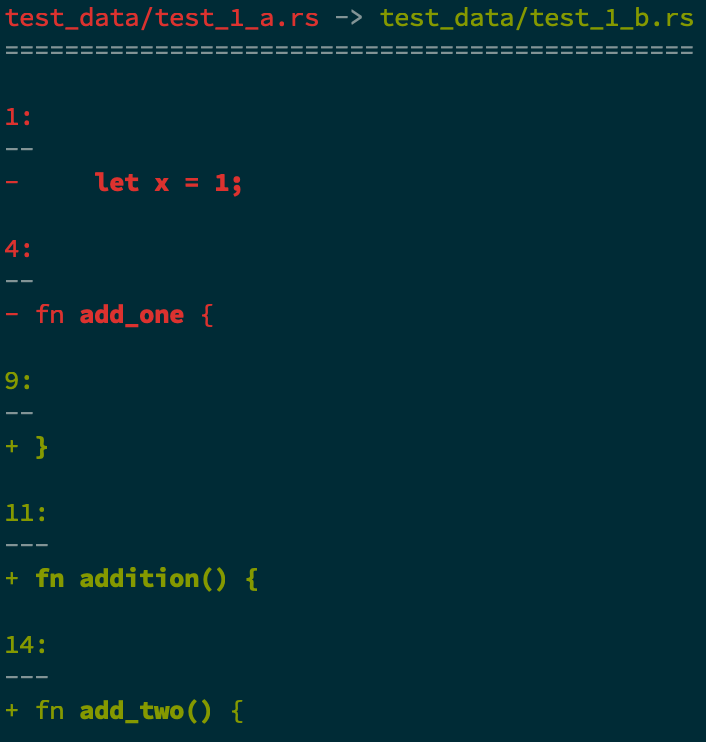

# diffsitter

[](https://github.com/afnanenayet/diffsitter/actions/workflows/CI.yml)
[](https://github.com/afnanenayet/diffsitter/actions/workflows/CD.yml)


[](https://asciinema.org/a/joEIfP8XoxUhZKXEqUD8CEP7j)

## Summary

`diffsitter` creates semantically meaningful diffs that ignore formatting
differences like spacing. It does so by computing a diff on the AST (abstract
syntax tree) of a file rather than computing the diff on the text contents of
the file.

`diffstter` uses the parsers from the
[tree-sitter](https://tree-sitter.github.io/tree-sitter) project to parse
source code. As such, the languages supported by this tool are restricted to the
languages supported by tree-sitter.

`diffsitter` supports the following languages:

* Bash
* C#
* C++
* CSS
* Go
* Java
* OCaml
* PHP
* Python
* Ruby
* Rust

## Examples

Take the following files:

[`a.rs`](test_data/test_1_a.rs)

```rust
fn main() {
    let x = 1;
}

fn add_one {
}
```

[`b.rs`](test_data/test_1_b.rs)

```rust
fn


main

()

{
}

fn addition() {
}

fn add_two() {
}
```

The standard output from `diff` will get you:

```text
1,2c1,12
< fn main() {
<     let x = 1;
---
> fn
>
>
>
> main
>
> ()
>
> {
> }
>
> fn addition() {
5c15
< fn add_one {
---
> fn add_two() {
```

You can see that it picks up the formatting differences for the `main`
function, even though they aren't semantically different.

Check out the output from `diffsitter`:

```text
test_data/test_1_a.rs -> test_data/test_1_b.rs
==============================================

1:
--
-     let x = 1;

4:
--
- fn add_one {

9:
--
+ }

11:
---
+ fn addition() {

14:
---
+ fn add_two() {
```

*Note: the numbers correspond to line numbers from the original files.*

Since it uses the AST to calculate the difference, it knows that the formatting
differences in `main` between the two files isn't a meaningful difference, so
it doesn't show up in the diff.

`diffsitter` has some nice (terminal aware) formatting too:



It also has extensive logging if you want to debug or see timing information:


## Installation

### Published binaries

This project uses Github actions to build and publish binaries for each tagged
release. You can download binaries from there if your platform is listed.

### Cargo

You can install using `cargo` the standard way with `cargo install diffsitter`.

### Homebrew

You can use my tap to install diffsitter:

```sh
brew tap afnanenayet/tap
brew install diffsitter
# brew install afnanenayet/tap/diffsitter
```

## Usage

For detailed help you can run `diffsitter --help` (`diffsitter -h` provides
brief help messages).

You can configure file associations and formatting options for `diffsitter`
using a config file. If a config is not supplied, the app will use the default
config, which you can see with `diffsitter --cmd dump_default_config`. It will
look for a config at `$XDG_HOME/.config` on macOS and Linux, and the standard
directory for Windows. You can also refer to the
[sample config](/assets/sample_config.json5).

*Note: the tests for this crate check to make sure the provided sample config
is a valid config.*

## Development

You need a Rust toolchain, which you can install from here: https://rustup.rs.
You will also need a C and C++ compiler, any standard-compliant one should be
fine (GCC, Clang, or Visual Studio).

If you're on Mac and have [Homebrew](https://brew.sh) installed:

```sh
brew install llvm

# or

brew install gcc
```

The built-in Apple clang that comes with XCode is also fine.

If you're on Ubuntu:

```sh
sudo apt install gcc
```

If you're on Arch Linux:

```sh
sudo pacman -S gcc
```

Once you have the requisite toolchains installed, you'll want to clone the
project and initialize submodules:

```sh
git clone
git submodule --init --recursive
```

This project targets the latest stable version of `rustc`, it may work on older
versions, but support is only guaranteed for the latest stable version.
